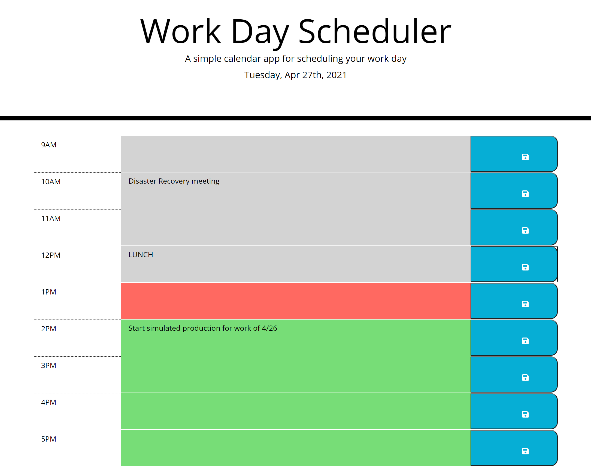

# Week05-work-day-scheduler

A workday scheduler/calendar that allows a user to save events for each hour of the day to local storage.

## Expected Behavior

* The current date is displayed at the top of the scheduler

* Business hours are 9:00am to 6:00pm

* Timeblocks for each hour are color coded to grey for times in the past, red for the current hour, and green for future timeblocks.

* The user can click into a timeblock, enter information, and save via a save button/icon

* Timeblock events will be saved to local storage for future use.

## Link to deployed application

[GitHub](https://fett-boba.github.io/Week05-work-day-scheduler/) https://fett-boba.github.io/Week05-work-day-scheduler/

## Assets

---

